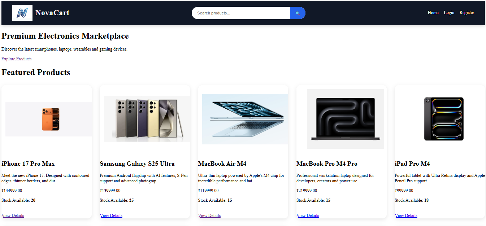
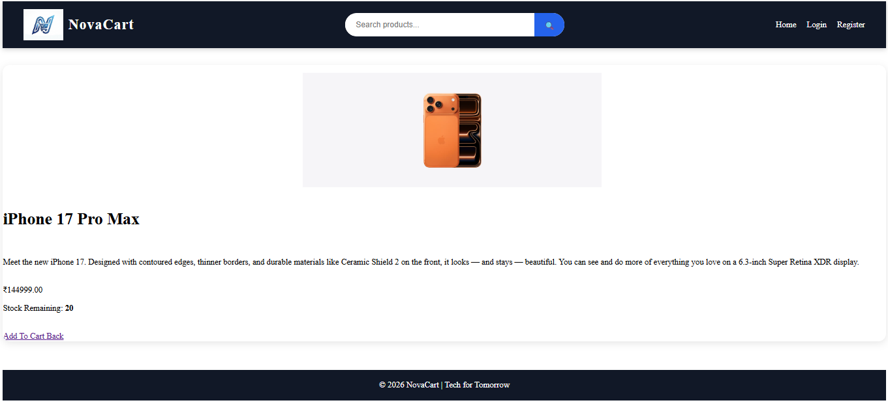

#  NovaCart - Console Based Ecommerce Store

NovaCart is a Java-based ecommerce shopping cart application developed using Object-Oriented Programming principles.

The application simulates the core functionality of an online shopping platform, allowing users to browse products, add items to a shopping cart, manage quantities, and calculate the final bill.

The project was designed to strengthen concepts of Java programming, collections framework, classes and objects, encapsulation, and modular application development.

---

## Features:

> Product Management

* Create Products
* Store Product Details
* Product ID Management
* Product Price Management

> Shopping Cart System

* Add Products to Cart
* Remove Products from Cart
* Update Product Quantity
* View Cart Contents

> Billing System

* Automatic Total Calculation
* Quantity-Based Price Calculation
* Dynamic Cart Updates

> Inventory Simulation

* Product Listing
* Product Availability Tracking
* Product Selection Using IDs

> Object-Oriented Design

* Class-Based Architecture
* Encapsulation
* Reusability
* Modular Code Structure

---

## Technology Stack:

| Category             | Technologies                      |
| -------------------- | --------------------------------- |
| Programming Language | Java                              |
| IDE Support          | VS Code / IntelliJ IDEA / Eclipse |
| Version Control      | Git                               |
| Repository Hosting   | GitHub                            |

---

## Project Structure:

```text
E-Commerce Shopping Cart/
│
├── src/
│   ├── Product.java
│   ├── CartItem.java
│   ├── ShoppingCart.java
│   └── Main.java
│
└── README.md
```
## Application Screenshots:

> Homepage

Browse featured products and explore the store catalog.



---

> Product Details Page

View product information, pricing, and purchase options.



---

## Class Overview:

### Product.java

Represents individual products available in the store.

Stores:

* Product ID
* Product Name
* Product Price

---

### CartItem.java

Represents items added to the shopping cart.

Stores:

* Product Information
* Quantity Selected

---

### ShoppingCart.java

Handles all cart operations.

Responsibilities:

* Add Items
* Remove Items
* Display Cart
* Calculate Total Price

---

### Main.java

Acts as the entry point of the application and manages user interaction.

---

## Installation Guide:

> Clone Repository

```bash
git clone https://github.com/syedmdamaanulhaque/CodeAlpha_tasks.git
```

> Navigate to Project Directory

```bash
cd "CodeAlpha_tasks/E-Commerce Shopping Cart/src"
```

> Compile Java Files

```bash
javac *.java
```

> Run Application

```bash
java Main
```

---

## Learning Outcomes:

This project helped in understanding:

* Java Syntax and Fundamentals
* Object-Oriented Programming Concepts
* Classes and Objects
* Encapsulation
* Constructors
* ArrayLists and Collections Framework
* Modular Programming
* Command Line Applications
* Git and GitHub Workflow

---

## Future Enhancements:

* Graphical User Interface (GUI)
* Database Integration
* User Authentication
* Order History
* Payment Gateway Simulation
* Product Search and Filtering
* Inventory Management System
* Admin Dashboard
* Discount Coupons
* Invoice Generation

---

## Author

**Syed Md Amaanul Haque**

GitHub Profile:
https://github.com/syedmdamaanulhaque

---


