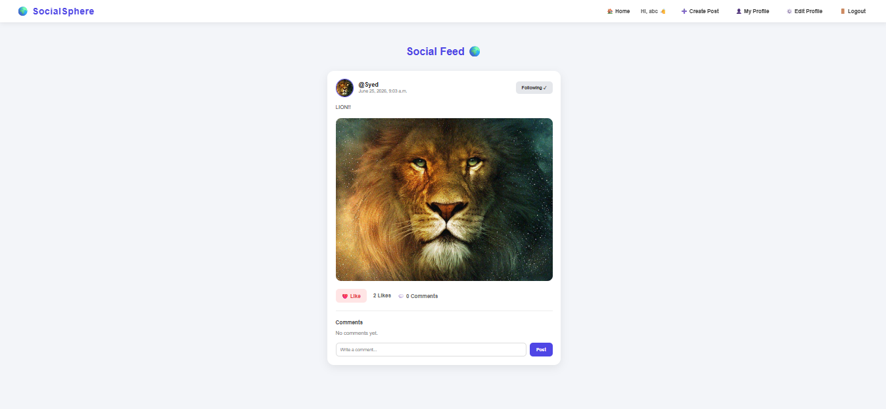
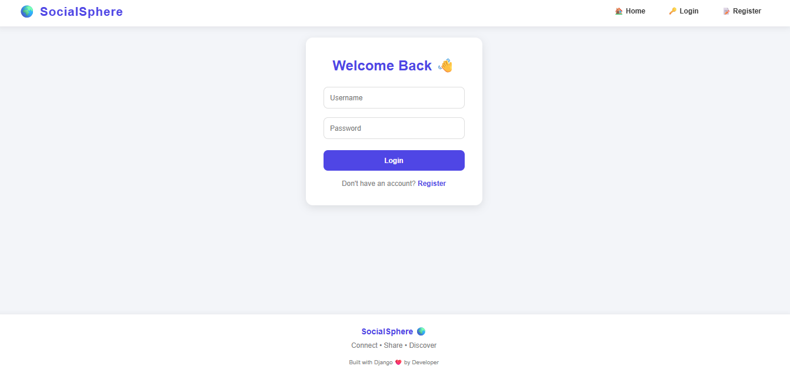
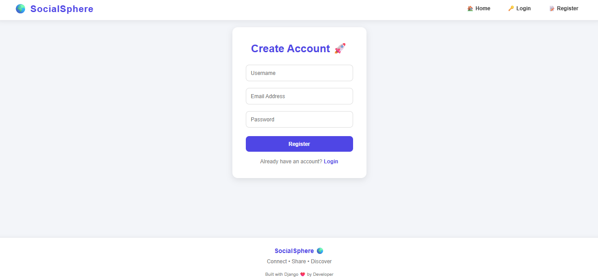
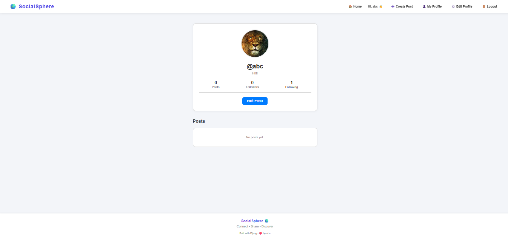
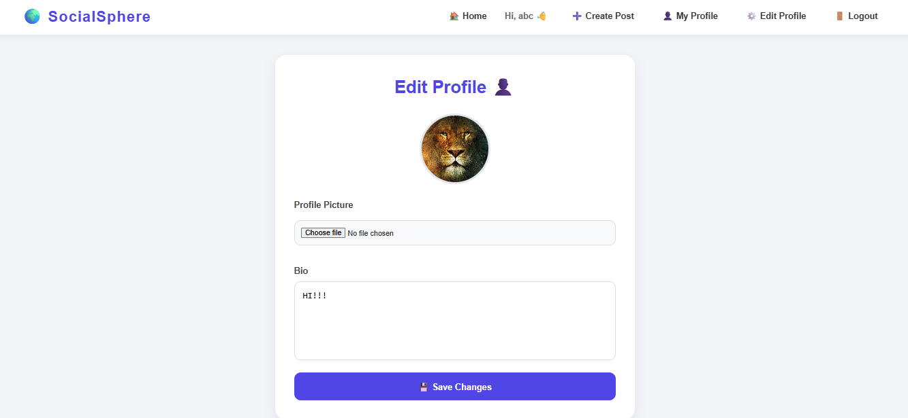
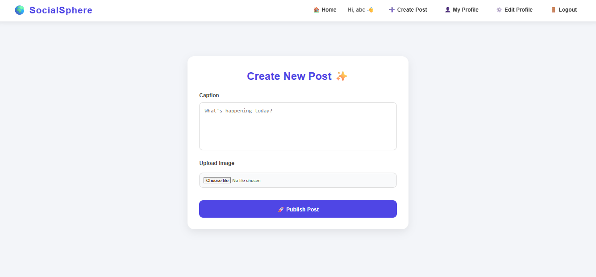

#  SocialSphere - Modern Social Media Platform

A full-stack social networking web application built using **Django**, designed to simulate the core functionalities of modern social media platforms.

SocialSphere enables users to create accounts, share posts with images, interact with other users through likes and comments, follow profiles, and personalize their presence with profile pictures and bios.

---

## Features:

###  Authentication System

* User Registration
* Secure User Login
* Logout Functionality
* Session-Based Authentication

###  User Profiles

* Custom Profile Pictures
* Personalized User Bios
* Followers Count
* Following Count
* Profile Statistics
* View User Posts

###  Post Management

* Create Posts with Captions
* Upload Images with Posts
* Chronological Feed Ordering
* Responsive Post Cards

###  Social Interactions

* Like Posts
* Comment on Posts
* Follow and Unfollow Users
* View Other User Profiles

###  Modern User Interface

* Responsive Navigation Bar
* Card-Based Feed Layout
* Profile Avatars
* Clean Minimal Design
* Mobile-Friendly Structure
* Modern Form Styling

---

## Technology Stack:

| Category         | Technologies            |
| ---------------- | ----------------------- |
| Backend          | Python, Django          |
| Database         | SQLite3                 |
| Frontend         | HTML5, CSS3, JavaScript |
| Version Control  | Git                     |
| Hosting Platform | GitHub                  |

---

## Project Structure:

```text
Social_Media_Platform/
│
├── backend/
│   │
│   ├── accounts/
│   ├── posts/
│   ├── interactions/
│   ├── socialmedia/
│   ├── templates/
│   ├── static/
│   ├── media/
│   └── manage.py
│
├── screenshots/
│
└── README.md
```

---

## Application Screenshots:

> Home Feed

Displays posts from users with likes, comments, and follow functionality.



---

> Login Page



---

> Registration Page



---

> User Profile Page



---

> Edit Profile Page



---

> Create Post Page



---

## Installation Guide

> Clone Repository

```bash
git clone https://github.com/syedmdamaanulhaque/CodeAlpha_tasks.git
```

> Move to Project Directory

```bash
cd CodeAlpha_tasks/Social_Media_Platform/backend
```

> Create Virtual Environment

```bash
python -m venv venv
```

> Activate Virtual Environment

Windows:

```bash
venv\Scripts\activate
```

Linux/Mac:

```bash
source venv/bin/activate
```

> Install Dependencies

```bash
pip install django
```

> Apply Database Migrations

```bash
python manage.py migrate
```

> Start Development Server

```bash
python manage.py runserver
```

Open your browser and visit:

```text
http://127.0.0.1:8000/
```

---

## Learning Outcomes:

This project helped in understanding:

* Django Project Structure
* Django Authentication System
* Models and Database Relationships
* File Upload Handling
* Template Rendering
* Static and Media File Management
* CRUD Operations
* Git and GitHub Workflow

---

## Future Enhancements:

* Direct Messaging System
* Real-Time Notifications
* Story Feature
* Search Functionality
* Dark Mode
* Hashtags and Trending Topics
* Email Verification
* Password Recovery
* Real-Time Chat
* Infinite Scrolling Feed

---

## Author

**Syed Md Amaanul Haque**

GitHub Profile:
https://github.com/syedmdamaanulhaque

---


